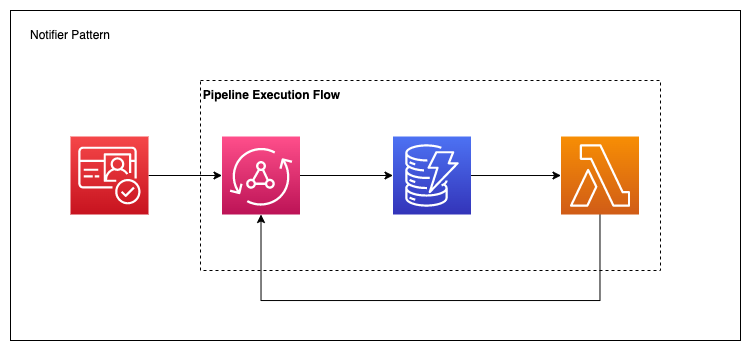

# AppSync Notification Pattern

This project is leverages the AWS CDK to create an API that can list products, and create new products. When a product is created, a DynamoDB stream triggers a Lambda function that calls an AppSync mutation. This mutation simply passes data to subscribing clients.

> But Michael, why don't you just subscribe to the `createProduct` mutation?

Great question! In this simple example, that may make sense, but recall that a pipeline resolver is a synchronous workflow. By having a DynamoDB trigger call a `publish` mutation, other our pipeline can contain asynchronous code (generating an AI image) and so long as our data table is updated, the client can be notified of updates along the chain.

Also, the `createProduct` mutation is connected to a DynamoDB datasource, however, the `publish` mutation is connected to a special `NONE` datasource. This allows for arbitrary data to be passed through to consumers without an intermediary step.

## Architecture Overview

This project uses the following AWS services:

- Amazon Cognito: Authorize our AppSync API
- Amazon DynamoDB: Stores Product information
- AWS Lambda: Triggered when an item is added to DynamoDB
- AWS AppSync: GraphQL API with a Query, Mutations, and Subscription
  - AppSync Pipeline resolvers
  - AppSync TypeScript functions

## Useful commands

- `npm run codegen` generate TS models
- `npm run build` compile typescript to js (also for AppSync resolvers)
- `npm run watch` watch for changes and compile
- `cdk deploy` deploy this stack to your default AWS account/region
